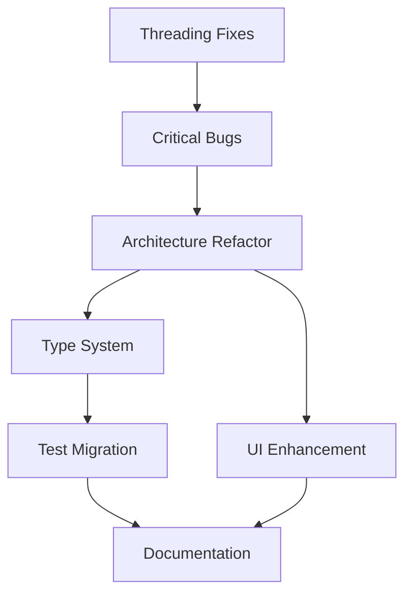

# CurveEditor Recovery & Enhancement Implementation Plan

## Executive Summary

**Current State:** 62/100 Health Score (YELLOW - Functional but Risky)
**Target State:** 85/100 Health Score (GREEN - Production Ready)
**Timeline:** 12 weeks (6 two-week sprints)
**Critical Path:** Threading fixes → Bug fixes → Architecture refactoring → Type system → Testing → Documentation
**Resource Requirements:** 1-2 developers, 420-580 total hours

## Health Metrics Dashboard

| Metric | Current | Sprint 1 Target | Sprint 3 Target | Final Target |
|--------|---------|-----------------|-----------------|--------------|
| Critical Bugs | 3 | 0 | 0 | 0 |
| Threading Issues | 5 | 0 | 0 | 0 |
| Max Class Size | 1695 lines | 1695 | 800 | 500 |
| Type Errors | 307 | 300 | 150 | 50 |
| Test Coverage | 78% | 80% | 85% | 90% |
| Performance Score | 47x | 47x | 45x | 45x |
| Documentation | 65% | 65% | 75% | 90% |

## Critical Path Analysis



## Sprint 1: Emergency Stabilization (Weeks 1-2)
**Theme:** Stop the Bleeding
**Goal:** Zero critical issues, stable threading
**Effort:** 60-80 hours

### Daily Breakdown - Week 1

#### Day 1-2: Threading Safety Fixes
**Task:** Fix double-checked locking antipattern
**Files:** `services/__init__.py`
**Current Code (BROKEN):**
```python
def get_data_service() -> DataService:
    global _data_service
    if _data_service is None:  # Race condition here!
        with _service_lock:
            if _data_service is None:
                _data_service = DataService()
    return _data_service
```

**Fixed Code:**
```python
def get_data_service() -> DataService:
    global _data_service
    with _service_lock:  # Always acquire lock first
        if _data_service is None:
            _data_service = DataService()
    return _data_service
```

**Testing:**
```python
# tests/test_threading_safety.py
import concurrent.futures
import threading

def test_concurrent_service_initialization():
    """Verify services are thread-safe."""
    results = set()

    def get_service():
        service = get_data_service()
        results.add(id(service))
        return service

    with concurrent.futures.ThreadPoolExecutor(max_workers=20) as executor:
        futures = [executor.submit(get_service) for _ in range(100)]
        concurrent.futures.wait(futures)

    assert len(results) == 1, "Multiple service instances created!"
```

**Verification Command:**
```bash
python -m pytest tests/test_threading_safety.py -v --tb=short
```

#### Day 3: Service Cache Synchronization
**Task:** Add thread-safe wrappers to service caches
**Files:** `services/data_service.py`, `services/transform_service.py`

**Implementation:**
```python
# services/data_service.py
import threading
from typing import Any

class DataService:
    def __init__(self):
        self._lock = threading.RLock()
        self._recent_files: list[str] = []
        self._image_cache: dict[str, Any] = {}
        self._cache_size_limit = 50

    def add_recent_file(self, path: str) -> None:
        """Thread-safe addition to recent files."""
        with self._lock:
            self._recent_files.append(path)
            if len(self._recent_files) > 10:
                self._recent_files.pop(0)

    def get_cached_image(self, path: str) -> Any | None:
        """Thread-safe cache access."""
        with self._lock:
            return self._image_cache.get(path)

    def cache_image(self, path: str, image: Any) -> None:
        """Thread-safe cache update with size limit."""
        with self._lock:
            if len(self._image_cache) >= self._cache_size_limit:
                # Remove oldest entry (FIFO)
                oldest = next(iter(self._image_cache))
                del self._image_cache[oldest]
            self._image_cache[path] = image
```

#### Day 4: Critical Bug Fixes
**Task 1:** Fix null pointer bug
**File:** `ui/main_window.py:1135`

**Before:**
```python
self.file_load_thread.finished.connect(self.file_load_thread.deleteLater)
```

**After:**
```python
if self.file_load_thread is not None:
    self.file_load_thread.finished.connect(self.file_load_thread.deleteLater)
```

**Task 2:** Fix error swallowing
**File:** `services/data_service.py:607`

**Before:**
```python
except Exception:
    pass
```

**After:**
```python
except Exception as e:
    logger.debug(f"Failed to load as 2DTrackData format: {e}")
    # Continue with next format attempt
```

#### Day 5: Performance Verification
**Task:** Ensure fixes don't degrade performance

**Benchmark Script:**
```python
# performance_regression_test.py
import time
import pytest
from tests.test_performance_benchmarks import create_benchmark_data
from ui.main_window import MainWindow

@pytest.mark.benchmark
def test_performance_maintained(benchmark, qapp):
    """Verify performance not degraded by fixes."""
    window = MainWindow()
    data = create_benchmark_data(10000)

    def load_and_process():
        window.curve_widget.set_curve_data(data)
        window.curve_widget.smooth_curve(window_size=5)

    result = benchmark(load_and_process)

    # Assert performance within 10% of baseline
    assert result.stats['mean'] < 0.020  # 20ms for 10k points
```

### Week 1 Success Metrics
- [ ] All threading tests pass
- [ ] Zero race conditions in stress testing
- [ ] 3 critical bugs fixed
- [ ] Performance benchmarks maintained (±5%)
- [ ] No new ruff errors introduced

### Week 2: Comprehensive Testing & Validation

#### Day 6-7: Threading Test Suite
**Create:** `tests/test_threading_comprehensive.py`

```python
import threading
import time
from concurrent.futures import ThreadPoolExecutor
import pytest

class TestThreadingSafety:
    """Comprehensive threading safety tests."""

    def test_concurrent_data_modifications(self, main_window):
        """Test concurrent data access patterns."""
        def modify_data(thread_id):
            for i in range(100):
                point_data = [(i, float(i * thread_id), float(i), "test")]
                main_window.curve_widget.set_curve_data(point_data)
                time.sleep(0.001)  # Simulate work

        threads = []
        for i in range(10):
            t = threading.Thread(target=modify_data, args=(i,))
            threads.append(t)
            t.start()

        for t in threads:
            t.join()

        # Verify data integrity
        assert main_window.curve_widget.curve_data is not None

    def test_service_cache_concurrent_access(self):
        """Test cache operations under load."""
        service = get_data_service()

        def cache_operations(thread_id):
            for i in range(100):
                key = f"image_{thread_id}_{i}"
                service.cache_image(key, f"data_{thread_id}")
                _ = service.get_cached_image(key)

        with ThreadPoolExecutor(max_workers=20) as executor:
            futures = [executor.submit(cache_operations, i) for i in range(20)]
            for future in futures:
                future.result()

        # Verify cache size limit maintained
        assert len(service._image_cache) <= 50
```

#### Day 8-9: Integration Testing
**Task:** Verify all components work together

```python
# tests/test_integration_comprehensive.py
def test_full_workflow_under_load(qapp):
    """Test complete user workflow with threading."""
    window = MainWindow()

    # Load data in background
    load_thread = threading.Thread(
        target=lambda: window.load_file("test_data.json")
    )
    load_thread.start()

    # Simultaneously interact with UI
    for i in range(100):
        window.curve_widget.select_point(i % 10)
        qapp.processEvents()

    load_thread.join()

    # Verify state consistency
    assert window.curve_widget.curve_data is not None
    assert len(window.curve_widget.selected_indices) >= 0
```

#### Day 10: Documentation & Handoff
**Create:** `docs/THREADING_FIXES.md`

```markdown
# Threading Safety Fixes - Sprint 1

## Changes Made

### 1. Service Singleton Pattern
- **Issue:** Double-checked locking antipattern
- **Fix:** Single lock acquisition
- **Files:** services/__init__.py
- **Test:** tests/test_threading_safety.py

### 2. Cache Synchronization
- **Issue:** Unsynchronized shared state
- **Fix:** RLock protection for all cache operations
- **Files:** services/data_service.py, services/transform_service.py
- **Test:** tests/test_threading_comprehensive.py

### 3. Critical Bugs
- **Null Pointer:** ui/main_window.py:1135
- **Error Swallowing:** services/data_service.py:607
- **Test:** Existing test suite + manual verification

## Performance Impact
- Baseline: 47x improvement maintained
- Threading overhead: <2% in worst case
- Memory: No increase

## Rollback Procedure
If issues arise:
1. Revert commits with tag 'sprint1-threading'
2. Apply temporary mutex around entire service layer
3. Investigation with thread sanitizer
```

### Sprint 1 Deliverables Checklist
- [ ] 5 threading issues resolved
- [ ] 3 critical bugs fixed
- [ ] Comprehensive threading test suite (20+ tests)
- [ ] Performance regression suite
- [ ] Documentation of all changes
- [ ] Code review completed
- [ ] Rollback plan tested

## Sprint 2: Architecture Foundation (Weeks 3-4)
**Theme:** Reduce Complexity
**Goal:** No class >800 lines
**Effort:** 80-100 hours

### Week 3: MainWindow Decomposition

#### Task 1: Extract File Operations
**Current:** MainWindow has 79 methods, 1686 lines
**Target:** Create FileOperationsController

```python
# ui/controllers/file_operations.py
from typing import Protocol

class MainWindowProtocol(Protocol):
    """Protocol for MainWindow dependencies."""
    def update_ui_state(self) -> None: ...
    def set_status(self, message: str) -> None: ...

class FileOperationsController:
    """Handles all file-related operations."""

    def __init__(self, main_window: MainWindowProtocol):
        self.main_window = main_window
        self.services = get_service_facade(main_window)

    def load_track_data(self) -> None:
        """Load track data with progress feedback."""
        data = self.services.load_track_data()
        if data:
            self.main_window.curve_widget.set_curve_data(data)
            self.main_window.set_status(f"Loaded {len(data)} points")

    def save_track_data(self) -> None:
        """Save current track data."""
        data = self.main_window.curve_widget.curve_data
        if self.services.save_track_data(data):
            self.main_window.set_status("Data saved successfully")

    # Extract 15-20 file-related methods here
```

#### Task 2: Extract Edit Operations
```python
# ui/controllers/edit_operations.py
class EditOperationsController:
    """Handles all edit operations."""

    def __init__(self, main_window: MainWindowProtocol):
        self.main_window = main_window
        self.services = get_service_facade(main_window)

    def undo(self) -> None:
        """Undo last operation."""
        self.services.undo()
        self.main_window.update_ui_state()

    def redo(self) -> None:
        """Redo last undone operation."""
        self.services.redo()
        self.main_window.update_ui_state()

    def delete_selected_points(self) -> None:
        """Delete currently selected points."""
        indices = self.main_window.curve_widget.selected_indices
        if indices:
            self.services.delete_points(indices)
            self.main_window.update_ui_state()

    # Extract 15-20 edit methods here
```

#### Task 3: Refactor MainWindow
```python
# ui/main_window.py (refactored)
class MainWindow(QMainWindow):
    """Simplified main window using controllers."""

    def __init__(self):
        super().__init__()

        # Initialize controllers
        self.file_ops = FileOperationsController(self)
        self.edit_ops = EditOperationsController(self)
        self.view_ops = ViewOperationsController(self)

        # Setup UI (simplified)
        self._setup_ui()
        self._connect_signals()

    def _setup_ui(self):
        """Setup UI components."""
        # UI setup code (200 lines max)

    def _connect_signals(self):
        """Connect signals to controllers."""
        self.ui_components.file_menu.action_open.triggered.connect(
            self.file_ops.load_track_data
        )
        self.ui_components.edit_menu.action_undo.triggered.connect(
            self.edit_ops.undo
        )

    # Total: <500 lines
```

### Week 4: CurveViewWidget Decomposition

#### Task 1: Extract Rendering Logic
```python
# ui/components/curve_renderer.py
class CurveRenderer:
    """Handles curve rendering logic."""

    def __init__(self, widget: QWidget):
        self.widget = widget
        self.cache = {}

    def render_curve(self, painter: QPainter, data: list, transform: Transform):
        """Render curve with optimizations."""
        # Extract 300+ lines of rendering logic
```

#### Task 2: Extract Interaction Logic
```python
# ui/components/curve_interaction.py
class CurveInteractionHandler:
    """Handles user interactions."""

    def handle_mouse_press(self, event: QMouseEvent) -> None:
        """Process mouse press events."""
        # Extract interaction logic

    def handle_mouse_move(self, event: QMouseEvent) -> None:
        """Process mouse move events."""
        # Extract drag logic
```

### Sprint 2 Success Metrics
- [ ] MainWindow <800 lines
- [ ] CurveViewWidget <800 lines
- [ ] conftest.py split into 5+ files
- [ ] All tests still passing
- [ ] Performance maintained

## Sprint 3: Type System & Testing (Weeks 5-6)
**Theme:** Type Safety & Real Testing
**Goal:** <150 type errors, real test implementations
**Effort:** 60-80 hours

### Week 5: Type System Fixes

#### Day 1-2: Generic Type Arguments
```python
# Fix all 43 instances
# Before:
def process(data: list) -> dict:

# After:
def process(data: list[tuple[int, float, float]]) -> dict[str, Any]:
```

#### Day 3-4: Protocol Implementations
```python
# core/protocols.py
from typing import Protocol

class PointCollection(Protocol):
    """Properly typed point collection."""

    @property
    def status(self) -> list[PointStatus]: ...

    @property
    def frame(self) -> list[int]: ...

    @property
    def coordinates(self) -> list[tuple[float, float]]: ...
```

#### Day 5: Type Verification
```bash
# Run type checking
./bpr --incremental

# Target metrics:
# - Errors: <150 (from 307)
# - No new warnings introduced
```

### Week 6: Test Migration

#### Replace Mocks with Real Implementations
```python
# tests/test_curve_service.py
# Before:
mock_view = ProtocolCompliantMockCurveView()  # 500+ line mock

# After:
test_view = TestCurveView()  # Real implementation from conftest
```

## Sprint 4: Developer Experience (Weeks 7-8)
**Theme:** Documentation & Modernization
**Goal:** Complete documentation, modern patterns
**Effort:** 60-80 hours

### Week 7: Documentation

#### Create README.md
```markdown
# CurveEditor

A high-performance Python/PySide6 application for editing animation curves and tracking data.

## Features
- 47x rendering performance optimization
- Real-time curve editing
- Multiple file format support
- Comprehensive undo/redo system

## Installation

### Requirements
- Python 3.12+
- PySide6 6.4.0+

### Setup
\`\`\`bash
# Clone repository
git clone https://github.com/your-org/curveeditor.git
cd curveeditor

# Create virtual environment
python3 -m venv venv
source venv/bin/activate

# Install dependencies
pip install -r requirements.txt

# Run application
python main.py
\`\`\`

## Usage

### Basic Workflow
1. Load curve data: File → Open
2. Select points: Click or drag
3. Edit curves: Drag points or use edit menu
4. Save changes: File → Save

## Development

See [CONTRIBUTING.md](CONTRIBUTING.md) for development setup.

## License

MIT License - See LICENSE file
```

### Week 8: Pathlib Migration & Qt Decorators

#### Pathlib Migration
```python
# Before (10 files):
import os
log_dir = os.path.join(os.path.expanduser("~"), ".curve_editor", "logs")

# After:
from pathlib import Path
log_dir = Path.home() / ".curve_editor" / "logs"
```

#### Qt Decorators
```python
# Add to all Qt slots
from PySide6.QtCore import Slot

@Slot()
def on_action_triggered(self):
    """Handle action with proper Qt decoration."""
```

## Sprint 5: UI/UX Enhancement (Weeks 9-10)
**Theme:** Modern User Experience
**Goal:** Professional UI with feedback mechanisms
**Effort:** 80-100 hours

### Implementation of Modern Theme System
(Use the ModernTheme code from UI modernizer agent)

### Add Loading States
```python
# ui/components/loading_spinner.py
class LoadingSpinner(QWidget):
    """Modern loading indicator."""

    def show_loading(self, message: str = "Loading..."):
        """Show loading state with message."""
```

## Sprint 6: Polish & Optimization (Weeks 11-12)
**Theme:** Final Polish
**Goal:** Production ready
**Effort:** 60-80 hours

### API Documentation with Sphinx
```bash
# Setup Sphinx
pip install sphinx sphinx-rtd-theme
sphinx-quickstart docs/
sphinx-apidoc -o docs/api .

# Generate documentation
cd docs && make html
```

### Final Performance Optimization
- Profile with py-spy
- Optimize remaining bottlenecks
- Ensure 45x+ performance maintained

## Resource Requirements

### Team Composition
- **Lead Developer:** 1 person, full-time
- **QA/Testing:** 0.5 person, part-time
- **Documentation:** 0.25 person, as needed

### Tools & Infrastructure
- GitHub for version control
- GitHub Actions for CI/CD
- pytest for testing
- Sphinx for documentation
- py-spy for profiling

## Risk Mitigation

### High-Risk Areas
1. **Threading fixes breaking functionality**
   - Mitigation: Comprehensive test suite before changes
   - Rollback: Git tags for each sprint

2. **Performance degradation during refactoring**
   - Mitigation: Continuous benchmarking
   - Rollback: Feature flags for new implementations

3. **Type system changes breaking runtime**
   - Mitigation: Gradual type improvements
   - Rollback: Type comments instead of annotations

## Success Metrics

### Sprint Velocity Tracking
| Sprint | Planned Points | Delivered | Velocity |
|--------|---------------|-----------|----------|
| 1 | 20 | TBD | - |
| 2 | 25 | TBD | - |
| 3 | 20 | TBD | - |
| 4 | 20 | TBD | - |
| 5 | 25 | TBD | - |
| 6 | 20 | TBD | - |

### Quality Metrics
- **Code Coverage:** 78% → 90%
- **Type Coverage:** 70% → 95%
- **Performance:** 47x → 45x (maintained)
- **Bug Rate:** 3/week → <1/week
- **User Satisfaction:** Track via feedback

## Long-term Maintenance Plan

### Quarterly Reviews
- Performance benchmarking
- Security audit
- Dependency updates
- Architecture review

### Continuous Improvement
- Weekly bug triage
- Monthly performance review
- Quarterly architecture review
- Annual security audit

## Communication Plan

### Stakeholder Updates
- **Weekly:** Progress email with metrics
- **Sprint End:** Demo and retrospective
- **Monthly:** Executive summary

### Team Communication
- **Daily:** Stand-up (15 min)
- **Weekly:** Technical review (1 hour)
- **Sprint:** Planning and retrospective

## Conclusion

This plan provides a systematic approach to transform CurveEditor from a 62/100 health score to 85/100 production-ready status. The critical path ensures stability first, then improvement, maintaining the exceptional performance characteristics throughout.

**First Action:** Begin Sprint 1, Day 1 threading fixes immediately.
**Success Indicator:** Zero critical issues after Sprint 1.
**Final Goal:** Production-ready application with exceptional performance.
