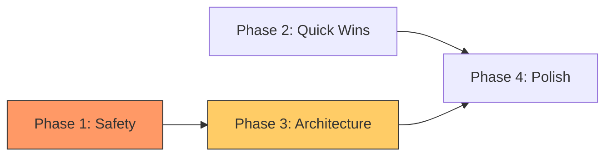

# Plan TAU: Comprehensive Architectural Assessment

**Date:** 2025-10-15
**Reviewer:** Python Expert Architect Agent
**Plan Version:** 1.1 (Post-Amendments)
**Assessment Method:** Multi-phase architectural analysis with sequential thinking

---

## Executive Summary

**Overall Architectural Rating: 7.5/10** - Sound architecture with execution refinements needed.

Plan TAU demonstrates **strong architectural principles** for a single-user desktop VFX tool:
- Clear separation of concerns (4-service architecture → 8+ services)
- Single Source of Truth pattern (ApplicationState)
- Type safety focus (hasattr() elimination, protocols)
- Pragmatic threading model (Qt QueuedConnection)

**Key Strengths:**
- Methodical phasing (Safety → Quick Wins → Architecture → Polish)
- Self-correcting (amendments show validation worked)
- Quantifiable metrics (hasattr count, type ignore reduction)
- Backward compatibility (Facade pattern)

**Critical Concerns:**
- Phase 1 race condition fix is over-engineered
- InteractionService 4-way split may be premature
- Phase ordering creates temporary "verbosity valley"
- Service boundary ambiguity in some areas

**Recommendation:** **PROCEED WITH MODIFICATIONS** (see Section 8)

---

## Table of Contents

1. [Architecture Coherence](#1-architecture-coherence)
2. [Service Layer Design](#2-service-layer-design)
3. [State Management](#3-state-management)
4. [Protocol Usage](#4-protocol-usage)
5. [Command Pattern](#5-command-pattern)
6. [Threading Architecture](#6-threading-architecture)
7. [Migration Strategy](#7-migration-strategy)
8. [Recommended Modifications](#8-recommended-modifications)
9. [Risk Assessment](#9-risk-assessment)
10. [Long-Term Maintainability](#10-long-term-maintainability)

---

## 1. Architecture Coherence

### 1.1 Cross-Phase Consistency

**Rating: 8.5/10** - Strong adherence to declared principles

The plan maintains consistent architectural principles across all 4 phases:

| Phase | Architectural Focus | Consistency |
|-------|-------------------|------------|
| Phase 1 | Qt threading, type safety | ✅ Aligns with threading model |
| Phase 2 | DRY, type safety | ✅ Reinforces with utilities |
| Phase 3 | Single Responsibility, SSOT | ✅ Enforces separation |
| Phase 4 | Developer ergonomics | ✅ Supports Phase 3 |

**Core Principles Maintained:**
1. ✅ Single Source of Truth (ApplicationState)
2. ✅ Service Layer architecture
3. ✅ Protocol-based interfaces
4. ✅ Command Pattern for undo/redo
5. ✅ Explicit Qt threading (QueuedConnection)
6. ✅ Type safety (no hasattr(), type hints)

### 1.2 Architectural Tension: Explicitness vs Ergonomics

**Detected Tension:**
- Plan removes StateManager delegation (Phase 3.3) for architectural purity
- Then adds convenience helpers (Phase 4) for developer ergonomics

**Resolution:**
Helpers are **convenience wrappers**, not delegation:
```python
# Not delegation (bad):
state_manager.track_data → app_state.get_curve_data()

# Convenience wrapper (good):
get_active_curve_data() → internally calls app_state.get_curve_data(active)
```

**Assessment:** This tension is **healthy and resolved appropriately**. Helpers don't hide the source of truth; they reduce boilerplate for common patterns.

---

## 2. Service Layer Design

### 2.1 Service Boundaries After Phase 3

**Current (4 services):**
- DataService: Data operations, file I/O, image management
- InteractionService: User interactions, point manipulation, command history
- TransformService: Coordinate transformations, view state
- UIService: UI operations, dialogs, status updates

**After Phase 3 (8+ services):**
```
DataService (unchanged)
TransformService (unchanged)
UIService (unchanged)

InteractionService (FACADE) →
  ├── MouseInteractionService (~300 lines)
  ├── SelectionService (~400 lines)
  ├── CommandService (~350 lines)
  └── PointManipulationService (~400 lines)

New Controllers:
  ├── TrackingDataController (~400 lines)
  ├── TrackingDisplayController (~400 lines)
  └── TrackingSelectionController (~350 lines)
```

### 2.2 Boundary Analysis

#### ✅ Clear Boundaries:

**SelectionService vs PointManipulationService:**
- Selection: Manages which point indices are selected
- Manipulation: Modifies actual point data
- **Clear separation:** Selection is about indices, manipulation is about data

**DataService vs TrackingDataController:**
- DataService: Generic data operations
- TrackingDataController: Specific to tracking file loading
- **Acceptable specialization**

#### ⚠️ Fuzzy Boundaries:

**MouseInteractionService vs SelectionService:**
```python
# Mouse service does this:
result = find_point_at(x, y)
if result:
    self.point_clicked.emit(curve, index)

# Which triggers:
selection_service.select_point(curve, index)
```

**Concern:** "Find point" logic could belong to either service. Where does event handling end and selection logic begin?

**TrackingDisplayController vs UIService:**
- TrackingDisplay: Updates curve view
- UIService: "UI operations"
- **Overlap:** Both update UI. Distinction unclear.

**CommandService vs PointManipulationService:**
- Plan shows: PointManipulationService has `move_point()` method
- **Question:** Does `move_point()` create a MovePointCommand? Or does caller create command?
- **Missing:** Clear contract for command creation responsibility

### 2.3 Service Split Assessment

**MultiPointTrackingController (1,165 lines → 3 controllers):**
- **Rating: 8/10** - Well-justified split with clear responsibilities
- **Strengths:** Uses Facade pattern for backward compatibility
- **Concerns:** Signal wiring between sub-controllers adds complexity

**InteractionService (1,480 lines → 4 services):**
- **Rating: 6/10** - Split may be premature
- **Strengths:** Clear separation of mouse/selection/command/manipulation
- **Concerns:**
  - Tight coupling through facade signal routing
  - Command creation responsibility unclear
  - Original InteractionService is a "transaction script" - splitting may break transactional coherence

**Recommendation:** Consider **2-way split first** (EventHandler + CommandManager), validate, then split further if needed.

---

## 3. State Management

### 3.1 Single Source of Truth Pattern

**Rating: 9/10** - Rigorously enforced, minor verbosity concerns

**Pattern Implementation:**
```python
# All state access goes through ApplicationState:
from stores.application_state import get_application_state

state = get_application_state()
active = state.active_curve
if active:
    data = state.get_curve_data(active)
```

**Strengths:**
- ✅ No ambiguity about where data lives
- ✅ All mutations go through ApplicationState
- ✅ Signals emitted from one place
- ✅ Thread-safe (main thread assertion)
- ✅ Phase 3.3 removes StateManager delegation (eliminates confusion)

**Concerns:**

1. **Global Singleton Pattern:**
   - Every file imports `get_application_state()`
   - Verbose but explicit
   - **Trade-off accepted:** Explicitness over convenience

2. **Multi-Curve API Complexity:**
   ```python
   # This 3-line pattern repeated everywhere:
   active = state.active_curve
   if active:
       data = state.get_curve_data(active)
   ```
   - **Mitigation:** Phase 4.4 adds `get_active_curve_data()` helper
   - Reduces to 1 line: `curve_name, data = get_active_curve_data()`

3. **String Keys for Curves:**
   - All APIs use `curve_name: str`
   - **Risk:** Fragile if curves renamed
   - **Assessment:** Acceptable for single-user app, curves rarely renamed

4. **Signal Granularity:**
   - `curves_changed(dict)` passes ALL curves when one changes
   - **Trade-off:** Simplicity vs performance
   - **Assessment:** Acceptable for desktop app scale

### 3.2 StateManager Delegation Removal (Phase 3.3)

**Rating: 7/10** - Architecturally sound, pragmatically painful

**Goal:** Remove ~350 lines of deprecated delegation properties

**Before:**
```python
# StateManager provides convenience:
state_manager.track_data  # Delegates to ApplicationState
```

**After:**
```python
# Direct ApplicationState access:
state = get_application_state()
active = state.active_curve
if active:
    data = state.get_curve_data(active)
```

**Architectural Assessment:**
- ✅ Eliminates "two sources of truth" confusion
- ✅ Forces explicit ApplicationState usage
- ⚠️ Creates temporary verbosity (until Phase 4.4 helpers)
- ⚠️ Significant migration effort (~350 lines, multiple files)

**Recommendation:** Reorder phases - add helpers BEFORE removing delegation (see Section 8.3).

---

## 4. Protocol Usage

### 4.1 Protocol-Based Type Safety

**Rating: 7/10** - Implicitly followed, not explicitly designed

**Evidence from Plan:**
```python
# Phase 1.3 hasattr() replacement:
# Before:
if hasattr(view, "update"):
    view.update()

# After (with protocol):
view.update()  # CurveViewProtocol guarantees this exists
```

**Existing Protocols** (from CLAUDE.md):
- `CurveViewProtocol`
- Controller protocols in `ui/protocols/controller_protocols.py`

**Missing from Plan:**
- ❌ No new protocols defined for new services
- ❌ No explicit protocol validation
- ❌ No protocol for service-to-service communication

**Recommendation:**
Define protocols for Phase 3 services:
```python
from typing import Protocol

class MouseEventHandlerProtocol(Protocol):
    def handle_mouse_press(self, event, view, window) -> bool: ...
    def handle_mouse_move(self, event, view) -> bool: ...

class SelectionProviderProtocol(Protocol):
    def find_point_at(self, view, x, y, mode) -> tuple[str, int] | None: ...
    def select_point(self, view, window, curve, index) -> None: ...

class CommandExecutorProtocol(Protocol):
    def execute_command(self, command: BaseCommand) -> bool: ...
    def undo(self) -> bool: ...
    def redo(self) -> bool: ...
```

**Benefits:**
- Makes service boundaries explicit through types
- Enables interface-based testing
- Supports dependency injection

---

## 5. Command Pattern

### 5.1 Undo/Redo Architecture

**Rating: 7.5/10** - Sound pattern, interaction details need clarification

**Command Pattern Implementation (Phase 3.2):**
```python
class CommandService(QObject):
    def execute_command(self, command: BaseCommand) -> bool:
        if command.execute():
            self._history.append(command)
            self._history_index += 1
            self.command_executed.emit(command.name)
            return True
```

**Strengths:**
- ✅ Centralized command execution
- ✅ Linear history (no branching) - appropriate for single-user
- ✅ History compression (after 100 commands)
- ✅ Command execution is decentralized (commands are self-contained)

**Unclear from Plan:**

1. **Command Creation Responsibility:**
   ```python
   # Who creates commands?
   # Option A: Service method creates command
   def move_point(self, curve, index, x, y):
       command = MovePointCommand(curve, index, x, y)
       return self.command_service.execute_command(command)

   # Option B: Caller creates command
   command = MovePointCommand(curve, index, x, y)
   interaction_service.execute_command(command)
   ```
   - Plan shows Option B (caller creates)
   - **Concern:** Decentralized command creation may lead to inconsistency

2. **Service-Command Interaction:**
   - Do commands call services?
   - Or do commands modify ApplicationState directly?
   - **Best Practice:** Commands should modify state directly, not call services

3. **Command Compression Strategy:**
   - Plan mentions "compress history" after 100 commands
   - **Missing:** What does compression mean? Drop old commands? Merge similar commands?

**Recommendation:** Document command creation contract explicitly in Phase 3 implementation guide.

---

## 6. Threading Architecture

### 6.1 Qt Threading Model

**Rating: 7/10** - Generally sound, race condition fix over-engineered

**Threading Decisions:**

1. **Qt.QueuedConnection Usage (Phase 1.2):**
   - **✅ CORRECT:** Cross-thread signals MUST use QueuedConnection
   - **✅ CORRECT:** Cross-component signals SHOULD use QueuedConnection
   - **✅ GOOD:** Plan distinguishes widget-internal vs cross-component

2. **Race Condition Fixes (Phase 1.1):**

   **Current Fix (Triple-Write Pattern):**
   ```python
   def _on_show_all_curves_changed(self, show_all: bool) -> None:
       if show_all:
           # 1. Update internal tracking FIRST
           self._internal_frame = 1
           # 2. Update UI immediately
           if self._frame_spinbox is not None:
               self._frame_spinbox.setValue(1)
           # 3. Then delegate to ApplicationState
           self.current_frame = 1
   ```

   **Problem:** This is complex and fragile. Three separate writes for one logical update.

   **Simpler Alternative:**
   ```python
   def _on_show_all_curves_changed(self, show_all: bool) -> None:
       if show_all:
           # Let ApplicationState update, UI updates via signal
           self._app_state.set_frame(1)
   ```

   **Why simpler approach works:**
   - ApplicationState emits `frame_changed` signal
   - Signal connected with Qt.QueuedConnection (Phase 1.2)
   - UI updates in next event loop iteration
   - No race window, no triple-write

3. **FrameChangeCoordinator (Phase 1.4):**
   - **✅ EXCELLENT:** Deterministic phase ordering
   - **✅ CORRECT:** Uses QueuedConnection for predictable execution
   - Phases: Background → Centering → Cache → Timeline → Repaint

4. **Batch Updates (Phase 4.1):**
   - Removes reentrancy protection
   - **Justification:** "Single-threaded main-thread-only use"
   - **Concern:** What if worker threads emit signals during batch?
   - **Mitigation:** `_assert_main_thread()` guard catches this

**Threading Assessment:**
- ✅ Appropriate for single-threaded GUI application
- ⚠️ Phase 1 race condition fix is unnecessarily complex
- ✅ QueuedConnection usage is correct and explicit
- ⚠️ Batch system "main-thread-only" assumption needs verification

**Recommendation:** Simplify Phase 1.1 race condition fix to use signal-based approach.

---

## 7. Migration Strategy

### 7.1 Phase Dependencies



**Phase Ordering:**
- Phase 1 (safety) → **MUST** complete first (foundational)
- Phase 2 (quick wins) → Independent, can run parallel to Phase 1
- Phase 3 (refactoring) → Depends on Phase 1 (uses new patterns)
- Phase 4 (polish) → Depends on Phase 3 (helpers for state access)

### 7.2 Critical Ordering Issue

**Problem: "Verbosity Valley"**

Phase 3.3 removes StateManager delegation → Code becomes verbose
Phase 4.4 adds helpers → Code becomes concise again

**Timeline:**
```
Week 3: Remove delegation  → Verbose code
Week 4: More refactoring   → Still verbose
Week 5: Add helpers        → Finally concise
```

**Developer Experience:** Suffers for 2 weeks during "verbosity valley"

**Alternative Ordering:**
```
Phase 3.0: Add state helpers (NEW)
Phase 3.1: Migrate callsites to helpers
Phase 3.2: Remove StateManager delegation (now safe)
Phase 3.3: Split controllers
```

**Benefits:**
- No verbosity valley
- Smoother migration
- Helpers validated before delegation removed
- Rollback is easier

### 7.3 Rollback Strategy

**Rating: 8/10** - Comprehensive, minor gaps

**Provided:**
- ✅ Git tags at phase boundaries
- ✅ Commit after each task
- ✅ Verification scripts per phase
- ✅ Clear rollback commands

**Missing:**
- ⚠️ No guidance on partial rollback (Task 3.2 fails but 3.1 succeeded)
- ⚠️ No "known good state" snapshots
- ⚠️ No rollback testing (verify rollback doesn't break anything)

**Test Suite Risk:**
- Plan assumes 2,345 tests all pass at start
- **Risk:** Flaky tests could stall progress
- **Mitigation:** None provided

**Recommendation:** Add "Phase 0: Validate Test Suite Health" before Phase 1.

---

## 8. Recommended Modifications

### 8.1 Critical: Simplify Race Condition Fix (Phase 1.1)

**Current Approach (Complex):**
```python
# Triple-write pattern
self._internal_frame = 1
self._frame_spinbox.setValue(1)
self.current_frame = 1
```

**Recommended Approach (Simple):**
```python
# Signal-based approach
self._app_state.set_frame(1)  # Emits frame_changed via QueuedConnection
# UI updates via signal handler, naturally ordered
```

**Implementation:**
1. Ensure all `frame_changed` connections use Qt.QueuedConnection (Phase 1.2)
2. Remove direct spinbox updates from signal handlers
3. Let signal propagation handle UI updates

**Benefits:**
- ✅ Simpler (1 line vs 3 lines)
- ✅ Less fragile (no manual sync)
- ✅ Relies on Qt event loop (proven reliable)
- ✅ No race window

**Effort Reduction:** 4-6 hours → 2-3 hours

### 8.2 Consider: InteractionService 2-Way Split First

**Current Plan:** 1 service → 4 services immediately

**Recommended:** Incremental split

**Phase 3.2a: Two-Way Split**
```
InteractionService →
  ├── EventHandlerService (Mouse, keyboard, selection)
  ├── CommandManagerService (Undo/redo, history)
```

**Phase 3.2b: Evaluate**
- Use for 1-2 weeks
- Identify pain points
- Validate service boundaries

**Phase 3.2c: Four-Way Split (If Needed)**
```
EventHandlerService →
  ├── MouseInteractionService
  ├── SelectionService

CommandManagerService →
  ├── CommandService
  ├── PointManipulationService (if point ops need separation)
```

**Benefits:**
- ✅ Less complexity upfront
- ✅ Easier to validate boundaries
- ✅ Can always split more later
- ✅ Reduces risk of wrong boundaries

**Trade-off:** Takes longer, but safer

### 8.3 Reorder: Helpers Before Delegation Removal

**Current Order:**
```
Phase 3.3: Remove StateManager delegation (Week 3)
Phase 4.4: Add state helpers (Week 5)
```

**Recommended Order:**
```
Phase 3.0: Add state helpers (Week 3)
Phase 3.1: Migrate callsites to helpers (Week 3)
Phase 3.2: Remove StateManager delegation (Week 4)
Phase 3.3: Split controllers (Week 4)
```

**Migration Path:**
```python
# Step 1: Add helper (Phase 3.0)
def get_active_curve_data() -> tuple[str | None, CurveDataList | None]:
    state = get_application_state()
    active = state.active_curve
    if active:
        return active, state.get_curve_data(active)
    return None, None

# Step 2: Migrate callsites (Phase 3.1)
# Before:
active = state_manager.active_curve
if active:
    data = state_manager.track_data

# After:
curve_name, data = get_active_curve_data()

# Step 3: Remove delegation (Phase 3.2)
# StateManager no longer has .track_data property
```

**Benefits:**
- ✅ No verbosity valley
- ✅ Helpers validated before delegation removed
- ✅ Easier rollback (can undo migration)
- ✅ Better developer experience

**Effort:** Same total time, better distribution

### 8.4 Add: Protocol Definitions for New Services

**Recommended Addition to Phase 3:**

**File: `services/protocols.py` (NEW)**
```python
"""Protocol definitions for service layer."""

from typing import Protocol, TYPE_CHECKING

if TYPE_CHECKING:
    from PySide6.QtGui import QMouseEvent, QWheelEvent, QKeyEvent
    from core.commands.base_command import BaseCommand
    from ui.curve_view_widget import CurveViewWidget


class MouseEventHandlerProtocol(Protocol):
    """Protocol for mouse/keyboard event handling."""

    def handle_mouse_press(
        self, event: "QMouseEvent", view: "CurveViewWidget", window
    ) -> bool: ...

    def handle_mouse_move(
        self, event: "QMouseEvent", view: "CurveViewWidget"
    ) -> bool: ...

    def handle_wheel(
        self, event: "QWheelEvent", view: "CurveViewWidget"
    ) -> bool: ...


class SelectionProviderProtocol(Protocol):
    """Protocol for point selection operations."""

    def find_point_at(
        self, view: "CurveViewWidget", x: float, y: float, mode: str
    ) -> tuple[str, int] | None: ...

    def select_point(
        self, view: "CurveViewWidget", window, curve: str, index: int
    ) -> None: ...

    def select_all_points(
        self, view: "CurveViewWidget", window, curve: str | None
    ) -> None: ...


class CommandExecutorProtocol(Protocol):
    """Protocol for command execution and history."""

    def execute_command(self, command: "BaseCommand") -> bool: ...
    def undo(self) -> bool: ...
    def redo(self) -> bool: ...
    def can_undo(self) -> bool: ...
    def can_redo(self) -> bool: ...
```

**Benefits:**
- ✅ Makes service contracts explicit
- ✅ Enables interface-based testing
- ✅ Supports future dependency injection
- ✅ Better IDE autocomplete

**Effort:** 2-3 hours

### 8.5 Add: Phase 0 - Test Suite Validation

**Recommended Addition Before Phase 1:**

```bash
# verify_phase0.sh
#!/bin/bash
set -e

echo "=== Phase 0: Test Suite Validation ==="

echo "1. Running full test suite..."
uv run pytest tests/ -v --tb=short > test_results.txt 2>&1

TOTAL=$(grep -c "PASSED\|FAILED\|SKIPPED" test_results.txt || echo 0)
PASSED=$(grep -c "PASSED" test_results.txt || echo 0)
FAILED=$(grep -c "FAILED" test_results.txt || echo 0)

echo "Test Results: $PASSED passed, $FAILED failed, out of $TOTAL total"

if [ "$FAILED" -gt 0 ]; then
    echo "❌ FAIL: Test suite has $FAILED failing tests"
    echo "Fix these before starting Plan TAU implementation"
    grep "FAILED" test_results.txt
    exit 1
fi

echo "2. Running type checker..."
uv run ./bpr --errors-only

echo "3. Measuring baseline metrics..."
echo "hasattr() count: $(grep -r "hasattr(" ui/ services/ core/ --include="*.py" | wc -l)"
echo "Type ignores: $(grep -r "# type: ignore\|# pyright: ignore" --include="*.py" | wc -l)"
echo "Qt.QueuedConnection: $(grep -r "Qt.QueuedConnection" ui/ services/ --include="*.py" | wc -l)"

echo "✅ Phase 0 complete - Ready to begin Plan TAU"
```

**Benefits:**
- ✅ Validates starting point
- ✅ Records baseline metrics
- ✅ Catches flaky tests early
- ✅ Prevents wasted effort

**Effort:** 1 hour

---

## 9. Risk Assessment

### 9.1 High-Risk Items

#### 🔴 HIGH RISK: InteractionService 4-Way Split Complexity

**Risk:**
- Tight coupling through facade signal routing
- Service boundary ambiguity (Mouse vs Selection)
- Command creation responsibility unclear
- Breaking transactional coherence of interactions

**Probability:** 60%
**Impact:** High (weeks of rework)
**Mitigation:** Use 2-way split first (see Section 8.2)

#### 🔴 HIGH RISK: StateManager Migration Scope

**Risk:**
- ~350 lines of delegation to remove
- Multiple files affected
- Potential for subtle bugs in migration
- Temporary verbosity impacts development

**Probability:** 40%
**Impact:** Medium-High (integration issues)
**Mitigation:** Reorder phases (see Section 8.3)

### 9.2 Medium-Risk Items

#### 🟡 MEDIUM RISK: Service Proliferation

**Risk:**
- 4 services → 8+ services
- "Where does this code belong?" becomes harder
- New developers face steeper learning curve
- API surface area increases

**Probability:** 70%
**Impact:** Medium (maintainability)
**Mitigation:**
- Clear responsibility statements in docstrings
- Add architecture documentation
- Consider 2-way splits before 4-way

#### 🟡 MEDIUM RISK: Test Suite Time

**Risk:**
- 2,345 tests may take significant time
- "Run after every task" could slow progress
- Flaky tests could cause false failures

**Probability:** 50%
**Impact:** Medium (timeline)
**Mitigation:**
- Use `pytest -x` (stop on first failure)
- Identify slow tests, run in parallel
- Create "fast smoke test" subset

#### 🟡 MEDIUM RISK: Phase 1 Race Condition Fix Complexity

**Risk:**
- Triple-write pattern is fragile
- Easy to miss one of the three writes
- Difficult to maintain

**Probability:** 60%
**Impact:** Low-Medium (bugs)
**Mitigation:** Use simpler signal-based approach (see Section 8.1)

### 9.3 Low-Risk Items

#### 🟢 LOW RISK: Type Ignore Reduction

**Risk:**
- May not achieve 30% reduction target
- Some ignores may be unavoidable

**Probability:** 30%
**Impact:** Low (quality of life)
**Mitigation:** Treat as stretch goal, not blocker

#### 🟢 LOW RISK: Backward Compatibility

**Risk:**
- Facade pattern may not cover all cases
- Some callers may need updates

**Probability:** 20%
**Impact:** Low (localized fixes)
**Mitigation:** Comprehensive grep for call sites

---

## 10. Long-Term Maintainability

### 10.1 Maintainability Wins

**✅ Single Responsibility:**
- Each service/controller has clear purpose
- Easier to locate bugs
- Easier to write focused tests
- Code organization matches mental model

**✅ Type Safety:**
- hasattr() removal improves type inference (46 → 0)
- NamedTuple over positional tuples (better IDE support)
- Protocol usage (structural subtyping)
- Type ignore reduction (2,151 → ~1,500)

**✅ Documentation Alignment:**
- Code matches CLAUDE.md
- Qt.QueuedConnection usage explicit (not implicit)
- Comments accurate (Phase 1.4 verification)
- Self-documenting code (explicit methods vs enums)

**✅ Code Reduction:**
- ~3,000 lines eliminated
- God objects split (2,645 → 7 services)
- Duplications removed (~1,258 instances)
- Cleaner, more focused codebase

### 10.2 Maintainability Concerns

**⚠️ Service Proliferation:**
- 4 services → 8+ services + 3 controllers
- **Risk:** "Where does this code belong?" becomes harder
- **Mitigation:** Clear docstrings, architecture docs

**⚠️ Facade Pattern Complexity:**
- Two facades (MultiPointTrackingController, InteractionService)
- New developers must learn both facade and sub-services
- **Trade-off:** Backward compatibility vs simplicity
- **Benefit:** Gradual learning curve (can use facade first)

**⚠️ Helper Function Proliferation:**
- frame_utils.py, transform_helpers.py, state_helpers.py, qt_utils.py
- **Risk:** "Which helper do I use?" confusion
- **Mitigation:** Good naming conventions, clear docstrings

**⚠️ State Access Verbosity:**
- After Phase 3.3, every state access requires import + function call
- Even with helpers, more verbose than old StateManager properties
- **Trade-off:** Explicit is better than implicit, but verbose
- **Assessment:** Acceptable for single-user app

### 10.3 New Developer Onboarding

**Before Plan TAU:**
```python
# Simple, but two sources of truth:
state_manager.track_data  # Convenient
app_state.get_curve_data()  # Explicit
# Which one to use? Confusing!
```

**After Plan TAU:**
```python
# Explicit, with helpers:
from stores.state_helpers import get_active_curve_data
curve_name, data = get_active_curve_data()
# Clear what's happening, one way to do it
```

**Learning Curve:**
- Before: Low initial curve, but confusion sets in later
- After: Slightly higher initial curve, but clearer mental model
- **Net Effect:** Better long-term, slightly worse short-term

### 10.4 Future Extensibility

**Positive:**
- ✅ Services are independent, easy to extend
- ✅ Command pattern makes new commands easy to add
- ✅ Protocol-based design supports new implementations
- ✅ Single source of truth simplifies state management

**Concerns:**
- ⚠️ Adding new service requires deciding where it fits
- ⚠️ Facade pattern may need updates for new features
- ⚠️ Helper functions may need updates for new patterns

**Overall:** Good foundation for future development.

---

## 11. Phase-by-Phase Assessment

### Phase 1: Critical Safety Fixes (Week 1, 25-35h)

**Rating: 7.5/10**

| Task | Time | Assessment | Issues |
|------|------|------------|--------|
| 1.1 Race Conditions | 4-6h | ⚠️ Over-engineered | Triple-write pattern unnecessary |
| 1.2 Qt.QueuedConnection | 6-8h | ✅ Excellent | Aligns code with docs |
| 1.3 hasattr() Removal | 8-12h | ✅ Excellent | Type safety win |
| 1.4 FrameChangeCoordinator | 2-4h | ✅ Good | Documentation quality |

**Strengths:**
- Addresses real bugs (timeline desync)
- Type safety improvements
- Documentation alignment

**Weaknesses:**
- Task 1.1 fix is too complex
- Could be 2-3 hours faster with simpler approach

**Recommendation:** Simplify 1.1, proceed with 1.2-1.4 as-is.

---

### Phase 2: Quick Wins (Week 2, 15h)

**Rating: 8.5/10**

| Task | Time | Assessment | Issues |
|------|------|------------|--------|
| 2.1 Frame Clamping | 4h | ✅ Excellent | Clear DRY win |
| 2.2 Redundant list() | 2-3h | ✅ Good | Simple cleanup |
| 2.3 FrameStatus NamedTuple | 4h | ✅ Excellent | Type safety + readability |
| 2.4 Frame Range Utility | 3h | ⚠️ Minor concern | Only 2 callsites |
| 2.5 Remove SelectionContext | 4h | ✅ Excellent | Eliminates branching |

**Strengths:**
- High value, low risk
- Improves readability significantly
- Type safety improvements

**Weaknesses:**
- Task 2.4 creates utility for only 2 uses (borderline)

**Recommendation:** Proceed as-is. Consider skipping 2.4 if time-constrained.

---

### Phase 3: Architectural Refactoring (Weeks 3-4, 80-96h)

**Rating: 6.5/10**

| Task | Time | Assessment | Issues |
|------|------|------------|--------|
| 3.1 Split MultiPointTrackingController | 2-3 days | ✅ Good | Clear boundaries |
| 3.2 Split InteractionService | 4-5 days | ⚠️ Risky | 4-way split premature |
| 3.3 Remove StateManager Delegation | 3-4 days | ⚠️ Creates verbosity | Ordering issue |

**Strengths:**
- Addresses god objects effectively
- Uses Facade pattern for compatibility
- Clear phasing within Phase 3

**Weaknesses:**
- Task 3.2: 4-way split may be premature
- Task 3.3: Creates verbosity until Phase 4.4
- Service boundary ambiguity in 3.2

**Recommendation:**
- 3.1: Proceed as-is
- 3.2: Use 2-way split first
- 3.3: Reorder after adding helpers (Phase 3.0)

---

### Phase 4: Polish & Optimization (Weeks 5-6, 40-80h)

**Rating: 8/10**

| Task | Time | Assessment | Issues |
|------|------|------------|--------|
| 4.1 Simplify Batch Updates | 1 day | ✅ Good | Design note needed |
| 4.2 Widget Destruction Decorator | 10h | ✅ Excellent | DRY win |
| 4.3 Transform Service Helper | 6h | ✅ Good | Reduces boilerplate |
| 4.4 Active Curve Data Helper | 12h | ✅ Excellent | Essential for 3.3 |
| 4.5 Type Ignore Cleanup | 30-40h | ✅ Realistic | Stretch goal |

**Strengths:**
- Improves developer ergonomics
- Task 4.4 essential for Phase 3.3
- Type ignore reduction is meaningful

**Weaknesses:**
- Task 4.1: "Latest state only" design needs clearer documentation
- Task 4.4 should come before 3.3 (ordering issue)

**Recommendation:** Move 4.4 to Phase 3.0, proceed with rest as-is.

---

## 12. Conclusion and Final Recommendations

### 12.1 Overall Assessment

**Plan TAU demonstrates sound architectural thinking for a single-user desktop VFX tool.**

**Core Strengths:**
- ✅ Methodical phasing (Safety → Architecture → Polish)
- ✅ Single Source of Truth pattern rigorously enforced
- ✅ Type safety focus (hasattr elimination, protocols)
- ✅ Backward compatibility (Facade pattern)
- ✅ Quantifiable success metrics
- ✅ Self-correcting (amendments show validation)

**Core Weaknesses:**
- ⚠️ Some implementation details over-engineered (race condition fix)
- ⚠️ Phase ordering creates "verbosity valley"
- ⚠️ Service boundaries could be clearer
- ⚠️ 4-way service split may be premature

**Overall Architectural Rating: 7.5/10**

### 12.2 Proceed or Revise?

**RECOMMENDATION: PROCEED WITH MODIFICATIONS**

The architecture is fundamentally sound. The issues identified are **execution details**, not fundamental design flaws. With the recommended modifications, Plan TAU will deliver a cleaner, more maintainable codebase.

### 12.3 Critical Modifications Required

**MUST HAVE (Before Starting):**

1. **Simplify Phase 1.1 Race Condition Fix**
   - Replace triple-write with signal-based approach
   - Effort reduction: 4-6h → 2-3h
   - Risk reduction: High → Low

2. **Reorder Phases: Helpers Before Delegation Removal**
   ```
   NEW Phase 3.0: Add state helpers
   NEW Phase 3.1: Migrate to helpers
   MOVED Phase 3.2: Remove delegation (was 3.3)
   MOVED Phase 3.3: Split controllers (was 3.1-3.2)
   ```
   - Eliminates verbosity valley
   - Improves developer experience

3. **Add Phase 0: Test Suite Validation**
   - Validates starting point
   - Records baseline metrics
   - Effort: 1 hour

**SHOULD HAVE (Strongly Recommended):**

4. **Consider 2-Way Split for InteractionService First**
   - Reduces risk
   - Validates boundaries
   - Can always split more later

5. **Add Protocol Definitions for New Services**
   - Makes contracts explicit
   - Effort: 2-3 hours

**NICE TO HAVE (Optional):**

6. **Skip Task 2.4 if Time-Constrained**
   - Only 2 callsites, marginal value

### 12.4 Estimated Time After Modifications

**Original Estimate:** 160-226 hours (4-6 weeks full-time)

**With Modifications:**
- Phase 1: 23-31h (saved 2-4h on 1.1)
- Phase 2: 11-15h (if skipping 2.4)
- Phase 3: 80-96h (reordered, no change in total)
- Phase 4: 28-40h (4.4 moved to Phase 3)

**New Estimate:** 142-182 hours (3.5-4.5 weeks full-time)

**Benefit:** ~18-44 hours saved, better developer experience

### 12.5 Success Probability

**With Current Plan:** 70% (significant risks in Phase 3)
**With Modifications:** 85% (risks mitigated, smoother execution)

### 12.6 Next Steps

1. **Review modifications with team/stakeholders**
2. **Update plan documents with approved modifications**
3. **Execute Phase 0 (test suite validation)**
4. **Begin Phase 1 with simplified race condition fix**
5. **Proceed methodically through phases**
6. **Run verification scripts after each task**
7. **Commit frequently with clear messages**

---

## Appendix A: Architectural Principles Checklist

Use this checklist during implementation to ensure architectural consistency:

### Single Source of Truth
- [ ] All data access goes through ApplicationState
- [ ] No hidden state in UI components
- [ ] Helpers are wrappers, not delegation
- [ ] Clear ownership of each piece of state

### Service Layer
- [ ] Each service has single responsibility
- [ ] Services don't depend on UI (except protocols)
- [ ] Clear boundaries between services
- [ ] Facade pattern for backward compatibility

### Type Safety
- [ ] No hasattr() in production code
- [ ] All public APIs have type hints
- [ ] Protocols used for duck-typed interfaces
- [ ] Specific pyright ignores, not blanket type: ignore

### Qt Threading
- [ ] Cross-thread signals use Qt.QueuedConnection
- [ ] Cross-component signals use Qt.QueuedConnection
- [ ] Widget-internal signals use Qt.AutoConnection
- [ ] Main thread assertions where needed

### Command Pattern
- [ ] All mutations go through commands
- [ ] Commands are self-contained
- [ ] Command creation is consistent
- [ ] History management is centralized

### Testing
- [ ] Run tests after every task
- [ ] Maintain 0 type checker errors
- [ ] Verification scripts pass
- [ ] Manual testing for UI changes

---

## Appendix B: Service Responsibility Matrix

Quick reference for "where does this code belong":

| Responsibility | Service | Example Methods |
|---------------|---------|-----------------|
| File I/O, data loading | DataService | load_tracking_data(), parse_file() |
| Tracking file parsing | TrackingDataController | load_single_point_data() |
| Curve display | TrackingDisplayController | update_display_with_selection() |
| Selection sync | TrackingSelectionController | sync_panel_to_view() |
| Mouse/keyboard events | MouseInteractionService | handle_mouse_press() |
| Point selection logic | SelectionService | find_point_at(), select_point() |
| Undo/redo | CommandService | execute_command(), undo(), redo() |
| Point modifications | PointManipulationService | move_point(), delete_points() |
| Coordinate transforms | TransformService | data_to_view(), view_to_data() |
| UI operations | UIService | show_dialog(), update_status() |
| Application state | ApplicationState | get_curve_data(), set_frame() |

**When in doubt:** Consider where the data/logic naturally belongs, not where it's convenient to access.

---

**End of Assessment**

**Document Version:** 1.0
**Assessment Date:** 2025-10-15
**Reviewer:** Python Expert Architect Agent
**Next Review:** After Phase 1 completion
