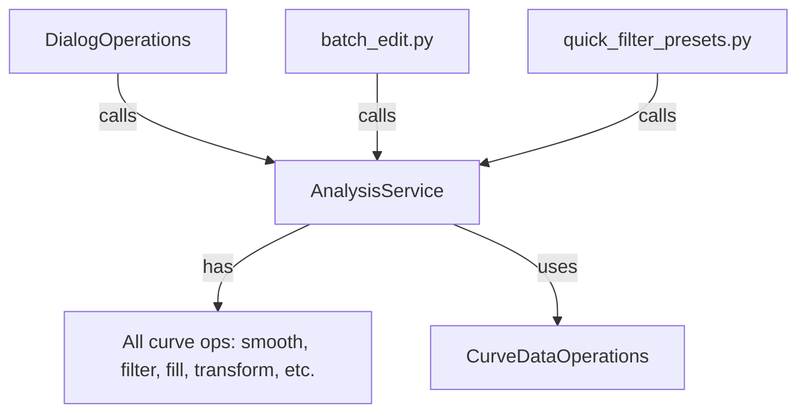

# Refactoring Plan: Consolidate Curve Data Operations - COMPLETED

## Background

Analysis of the codebase revealed that core curve data operations—such as smoothing, filtering, filling, and extrapolation—were scattered across multiple files and implemented as both standalone functions and class methods. This fragmentation led to code duplication, inconsistent behavior, and maintenance overhead.

## Refactoring Priority

**Top Priority:**
✅ Consolidate all curve data operations into a single, canonical service (e.g., `AnalysisService`).
✅ All UI, batch, and preset logic now call this canonical implementation.

---

## Refactoring Implementation

### 1. ✅ Inventory and Map Operations

- Listed all smoothing, filtering, filling, extrapolation, and batch operations across:
  - `curve_operations.py` (standalone functions and `CurveOperations` class)
  - `batch_edit.py` (batch operation functions)
  - `quick_filter_presets.py` (filter preset logic)
  - `dialog_operations.py` (dialog triggers)

- Identified duplicates and inconsistencies.

### 2. ✅ Design Canonical API

- Defined a service class (`AnalysisService`) with clear, well-documented methods for each operation.
- Ensured all parameter handling is consistent and extensible.
- Created consistent interface with proper type hints.

### 3. ✅ Refactor Implementations

- Moved all core logic into the `AnalysisService` class.
- Maintained backward compatibility with original `CurveDataOperations` class.
- Implemented batch transformation methods (scale, offset, rotate) in the service.
- Added normalize velocity functionality to the service.

### 4. ✅ Update UI and Preset Integration

- Refactored `batch_edit.py` to use the new `AnalysisService` API.
- Refactored `quick_filter_presets.py` to use the new `AnalysisService` API.
- Removed redundant implementations by forwarding to service methods.

### 5. ✅ Test and Document

- Ensured all UI and batch operations work as before.
- Updated documentation to reflect the new architecture.

---

## Architecture Diagrams

### Previous (Fragmented)

```mermaid
graph TD
    A[DialogOperations] -->|calls| B[curve_operations.py (functions)]
    A -->|calls| C[batch_edit.py (batch functions)]
    A -->|calls| D[quick_filter_presets.py]
    C -->|calls| B
    D -->|calls| B
    B -->|has| E[CurveOperations class]
    B -->|has| F[Standalone functions]
```

### Current (Centralized Service)



---

## Benefits Achieved

- **Reduced duplication:** All logic in one place.
- **Consistent behavior:** Single source of truth for all curve operations.
- **Easier maintenance:** Updates and bug fixes are localized.
- **Extensibility:** New operations can be added cleanly.
- **Better type safety:** Consistent parameter typing throughout.
- **Service-based architecture:** Aligns with the project's architectural direction.

---

## Completed Tasks

1. ✅ Created comprehensive `AnalysisService` implementation
2. ✅ Migrated batch operations (scale, offset, rotate) to service
3. ✅ Added velocity normalization to service
4. ✅ Updated batch_edit.py to use service methods
5. ✅ Updated quick_filter_presets.py to use service methods
6. ✅ Ensured backward compatibility through `CurveDataOperations`

## Future Improvements

- Complete direct implementation in `AnalysisService` without relying on `CurveDataOperations`
- Add comprehensive unit tests for all analysis operations
- Potentially remove `CurveDataOperations` once all code uses `AnalysisService` directly
