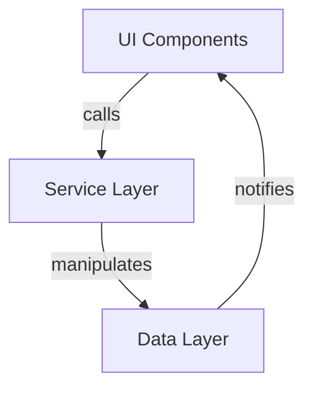
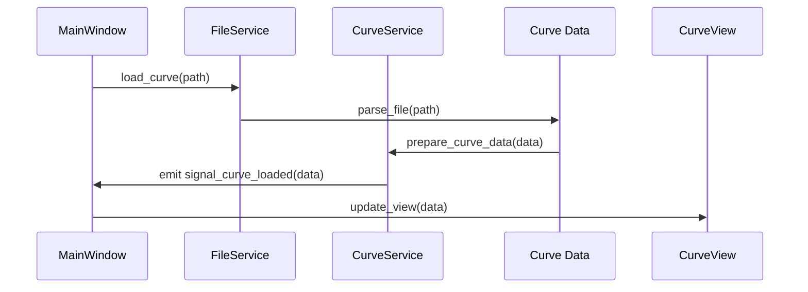
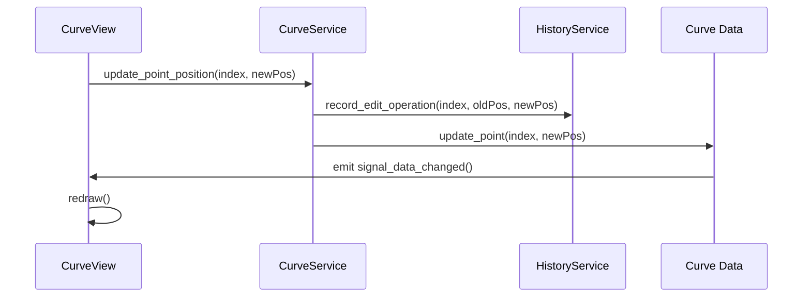
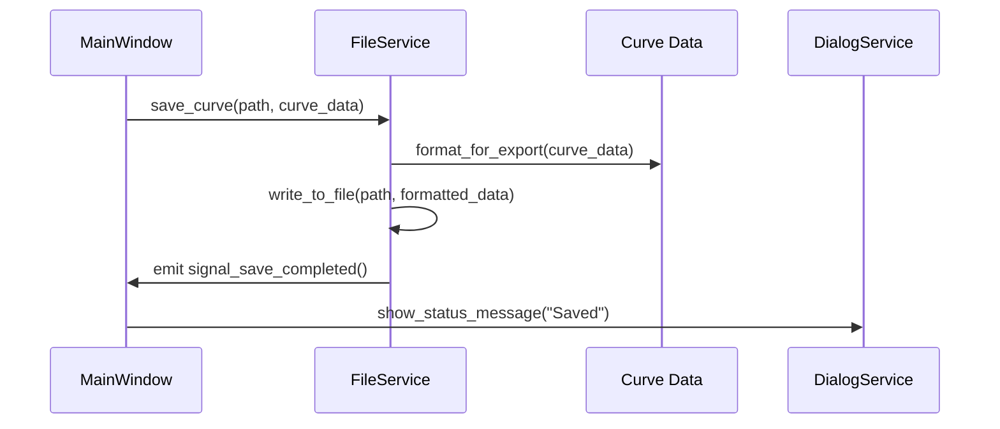

# Architecture Overview

This document provides a high-level overview of the CurveEditor application architecture.

## Service-Based Architecture

CurveEditor has been refactored to use a service-based architecture that improves modularity, testability, and maintainability. The application is organized into three main layers:

### 1. UI Layer

- **MainWindow**: The primary Qt window (`main_window.py`) hosting UI elements.
- **CurveView**: Custom QWidget rendering curves and control points.
- **Other UI Components**: Timeline, controls, and dialog components.

### 2. Service Layer

Services are implemented as classes with static methods that provide a functional interface for specific domains:

- **CurveService**: Manages curve view operations and point manipulation.
- **ImageService**: Handles image sequence loading and display.
- **FileService**: Manages file loading/saving operations.
- **HistoryService**: Provides undo/redo functionality.
- **DialogService**: Manages UI dialogs and interactions.
- **AnalysisService**: Handles curve data analysis and transformations.
- **VisualizationService**: Controls grid, vectors, and display features.
- **CenteringZoomService**: Manages view centering and zoom operations.
- **SettingsService**: Handles application settings.
- **InputService**: Processes keyboard and mouse input.

### 3. Data Layer

- **Curve Data**: Structures for storing curve points and metadata.
- **Image Data**: Handles image sequence metadata and caching.
- **Settings**: Application configuration data.
- **History Data**: Undo/redo state information.

## Interactions



## Package Layout

```text
CurveEditor/
├── main_window.py
├── curve_view.py
├── main.py
├── services/
│   ├── __init__.py
│   ├── curve_service.py
│   ├── image_service.py
│   ├── file_service.py
│   ├── history_service.py
│   ├── dialog_service.py
│   ├── analysis_service.py
│   ├── visualization_service.py
│   ├── centering_zoom_service.py
│   ├── settings_service.py
│   └── input_service.py
├── tests/
│   ├── __init__.py
│   ├── test_curve_service.py
│   └── ...
└── docs/
    ├── architecture.md
    ├── features.md
    └── refactoring_notes.md
```

## Detailed Workflows

### Loading a Curve



### Editing Control Points



### Saving a Curve


