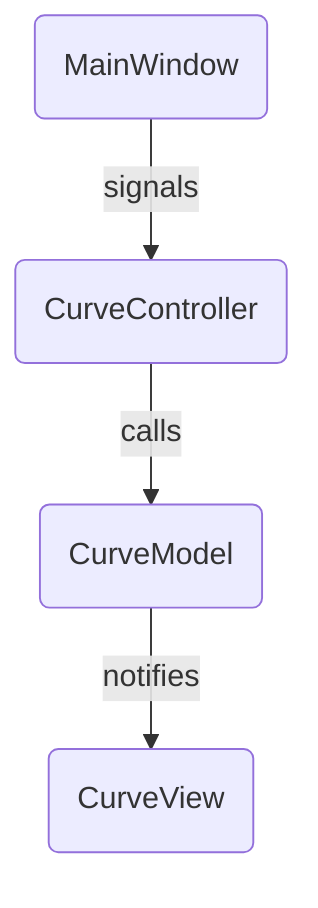
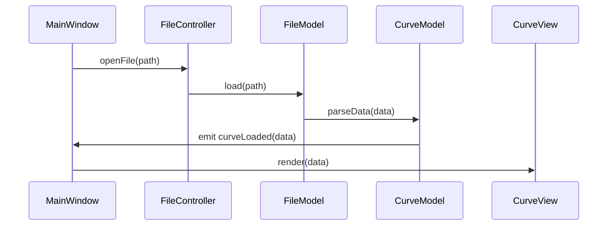
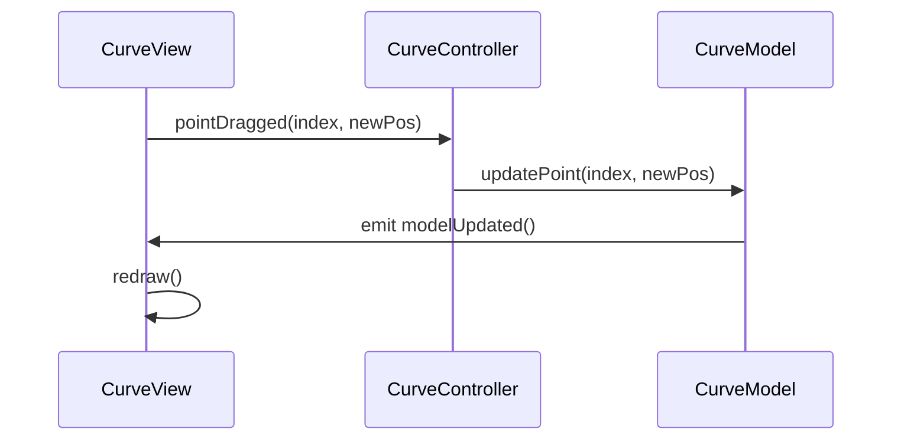

# Architecture Overview

This document provides a high-level overview of the CurveEditor application architecture.

## Components

### 1. Model

- **CurveModel**: Manages curve data structures, control points, and transformations.
- **FileModel**: Handles loading/saving curves from/to files (CSV, JSON).

### 2. View

- **MainWindow**: The primary Qt window (`main_window.py`) hosting UI elements.
- **CurveView**: Custom QWidget rendering curves and control points.

### 3. Controller / Logic

- **CurveController**: Connects UI interactions to model updates.
- **FileController**: Manages import/export commands and dialogs.

## Interactions



## Package Layout

```text
CurveEditor/
├── controllers/
│   ├── curve_controller.py
│   └── file_controller.py
├── models/
│   ├── curve_model.py
│   └── file_model.py
├── views/
│   ├── main_window.py
│   └── curve_view.py
├── utils/
│   └── history_manager.py
└── docs/
    ├── architecture.md
    └── features.md
```

## Detailed Workflows

### Loading a Curve



### Editing Control Points



### Saving a Curve

```mermaid
sequenceDiagram
    participant UI as MainWindow
    participant Ctrl as FileController
    participant FM as FileModel

    UI->>Ctrl: saveFile(path)
    Ctrl->>FM: save(path, CurveModel.data)
    FM->>UI: emit saveCompleted()
    UI->>MainWindow: showStatus("Saved")
