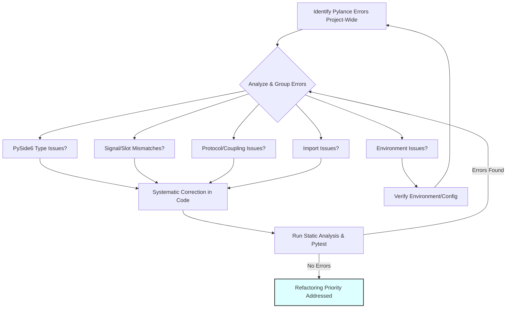

# Refactoring Plan: Address Pylance Errors

**Date:** 2025-04-23

**Priority:** High

## 1. Goal

Resolve widespread Pylance errors reported after recent major refactoring efforts (PySide6 migration, service layer introduction, signal registry centralization, import standardization). The primary goal is to improve code health, type safety, and overall stability, ensuring the benefits of the refactoring are realized. The initial focus will be on `signal_registry.py` and its interactions with `main_window.py` and the `services/` layer.

## 2. Background

Recent Memory Bank entries (`activeContext.md`) highlighted numerous Pylance errors (unresolved imports, type mismatches, attribute errors) appearing after significant architectural changes. These errors suggest potential inconsistencies or issues related to type hinting, signal/slot signatures, component coupling, or environment configuration, particularly within the centralized `signal_registry.py`.

## 3. Plan Steps

1.  **Identify Specific Errors:**
    *   Utilize Pylance (or similar static analysis tools) to generate a comprehensive list of all reported errors project-wide.
    *   Pay specific attention to errors originating in or related to `signal_registry.py`, `main_window.py`, and files within the `services/` directory.

2.  **Analyze Root Cause:**
    *   Group similar errors together.
    *   Analyze the root cause for each group. Potential causes include:
        *   Incorrect PySide6 type usage or API calls.
        *   Mismatched signal/slot signatures or connection parameters.
        *   Issues with the `MainWindowProtocol` definition or usage.
        *   Inconsistent application of the standardized import pattern (`CurveService as CurveViewOperations`).
        *   Potential environment or Pylance configuration issues.

3.  **Systematic Correction:**
    *   Address the identified errors systematically, prioritizing `signal_registry.py`.
    *   Corrections may involve:
        *   Updating type hints for variables, parameters, and return values.
        *   Adjusting parameters in signal connections (`connect()`) or signal definitions (`Signal()`).
        *   Refining the `MainWindowProtocol` to accurately reflect the required interface.
        *   Ensuring consistent use of the established import alias pattern.
        *   Investigating and resolving any identified environment/configuration issues.

4.  **Verification:**
    *   After applying fixes, re-run static analysis (Pylance, potentially mypy) to confirm errors are resolved.
    *   Execute the existing unit test suite (`pytest`) to ensure no regressions have been introduced.
    *   Add new unit tests where necessary to cover the corrected code sections, particularly focusing on signal emissions, handler logic, and type interactions.

## 4. Workflow Diagram

## 5. Next Action

Switch to Code mode to begin implementation, starting with Step 1 (Identify Specific Errors).