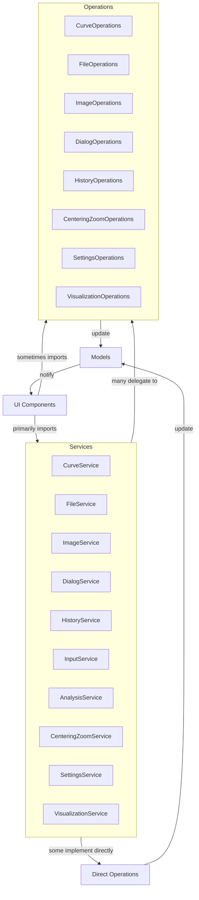

# Refactoring Notes: Service-Based Architecture

## Overview

The CurveEditor has been refactored to use a service-based architecture that standardizes how operations are accessed throughout the application. This document outlines the key changes and explains the new import patterns.

## Current State of Refactoring

### 1. Service Classes Implementation

The following service classes have been implemented:

- `CurveService`: Handles curve view operations (migrated from `curve_view_operations.py`)
- `FileService`: Manages file operations
- `ImageService`: Handles image-related operations
- `DialogService`: Manages dialog operations
- `HistoryService`: Handles undo/redo functionality
- `InputService`: Manages input handling for mouse and keyboard events
- `AnalysisService`: Handles track analysis operations
- `CenteringZoomService`: Manages view centering and zoom operations
- `SettingsService`: Handles application settings
- `VisualizationService`: Manages visualization options

### 2. Migration Progress

The refactoring is in a **completed state**:

- ✅ `curve_view_operations.py` has been fully migrated to `services/curve_service.py` and renamed to `curve_view_operations.deprecated`
- ✅ `dialog_operations.py` has been fully migrated to `services/dialog_service.py` and replaced with a redirect stub
- ✅ `file_operations.py` has been fully migrated to `services/file_service.py` and renamed to `file_operations.py.deprecated`
- ✅ `image_operations.py` has been fully migrated to `services/image_service.py` and renamed to `image_operations.py.deprecated`
- ✅ `history_operations.py` has been fully migrated to `services/history_service.py` and replaced with a redirect stub
- ✅ `visualization_operations.py` has been fully migrated to `services/visualization_service.py` with a backward compatibility stub
- ✅ `centering_zoom_operations.py` has been fully migrated to `services/centering_zoom_service.py` with a backward compatibility stub
- ✅ `settings_operations.py` has been fully migrated to `services/settings_service.py` with a backward compatibility stub

All operations files now forward to their corresponding service implementations with proper deprecation warnings.

### 3. Import Patterns

Two import patterns are currently in use:

#### Direct use of service classes:
```python
from services.curve_service import CurveService as CurveViewOperations
from services.file_service import FileService as FileOperations
from services.image_service import ImageService as ImageOperations
from services.dialog_service import DialogService as DialogOperations
from services.history_service import HistoryService
```

#### Legacy import pattern (still present in some files):
```python
import file_operations
from history_operations import HistoryOperations
```

### 4. Legacy Files Status

- ✅ `curve_view_operations.py` has been fully migrated and renamed to `.deprecated`
- ✅ `file_operations.py` has been fully migrated and renamed to `.deprecated`
- ✅ `image_operations.py` has been fully migrated and renamed to `.deprecated`
- ✅ `history_operations.py` has been fully migrated and a stub forwards calls to the service
- ⚠️ Other operations files are in a transitional state:
  - They still exist in the project root
  - Their corresponding service classes often act as thin facades
  - Some code still imports directly from the operations files

## Updated Architecture



## Next Steps for Complete Refactoring

To fully migrate to the service-based architecture, the following steps are recommended:

1. **Complete migration of operations to services:**
   - Move all functionality from legacy operations files to their corresponding service classes
   - Ensure service classes implement operations directly rather than delegating

2. **Standardize imports across the codebase:**
   - Update all imports to consistently use the service classes
   - Remove references to legacy operations files

3. **Remove legacy operations files:**
   - After verifying all functionality has been migrated, rename legacy files to `.deprecated`
   - Eventually remove deprecated files when confident all functionality is properly migrated

4. **Update documentation:**
   - Maintain this document with current progress status
   - Update architecture diagrams to reflect the current state

## Benefits of Refactoring

1. **Improved Code Organization**: Related functionality is grouped together in service classes.
2. **Reduced Duplication**: Common operations are centralized in one place.
3. **Consistent Interface**: Services provide a uniform interface for operations.
4. **Easier Maintenance**: Changes to functionality only need to be made in one place.
5. **Better Testing**: Services can be tested independently of UI components.

## Migration Guide

When working with the codebase:

1. Always import services using the standardized pattern
2. Add new functionality directly to the appropriate service class, not legacy operations
3. When modifying existing code, prefer using services over legacy operations
4. Update tests to reflect the new service-based architecture
