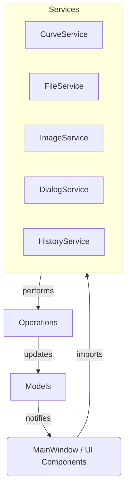

# Refactoring Notes: Service-Based Architecture

## Overview

The CurveEditor has been refactored to use a service-based architecture that standardizes how operations are accessed throughout the application. This document outlines the key changes and explains the new import patterns.

## Key Changes

### 1. Creation of Service Classes

Operations that were previously scattered across utility modules have been consolidated into service classes:

- `CurveService`: Handles all curve view operations (previously in `curve_view_operations.py`)
- `FileService`: Manages file operations
- `ImageService`: Handles image-related operations
- `DialogService`: Manages dialog operations
- `HistoryService`: Handles undo/redo functionality

### 2. Standardized Import Pattern

To maintain consistency, services are imported using a standard pattern:

```python
from services.curve_service import CurveService as CurveViewOperations
from services.file_service import FileService as FileOperations
from services.image_service import ImageService as ImageOperations
from services.dialog_service import DialogService as DialogOperations
from services.history_service import HistoryService
```

This pattern ensures that:
- New code uses the service-based architecture
- Legacy code references (like `CurveViewOperations`) still work correctly
- Modules interact with services using a consistent interface

### 3. Removal of Legacy Files

The following legacy files have been removed after their functionality was migrated to services:

- `curve_view_operations.py` → Replaced by `services/curve_service.py`

### 4. Updated Architecture



## Benefits of Refactoring

1. **Improved Code Organization**: Related functionality is grouped together in service classes.
2. **Reduced Duplication**: Common operations are centralized in one place.
3. **Consistent Interface**: Services provide a uniform interface for operations.
4. **Easier Maintenance**: Changes to functionality only need to be made in one place.
5. **Better Testing**: Services can be tested independently of UI components.

## Migration Guide

When working with the codebase:

1. Always import services using the standardized pattern
2. Add new functionality to the appropriate service class
3. Use the service through the imported alias in UI components
4. Update tests to reflect the new service-based architecture
